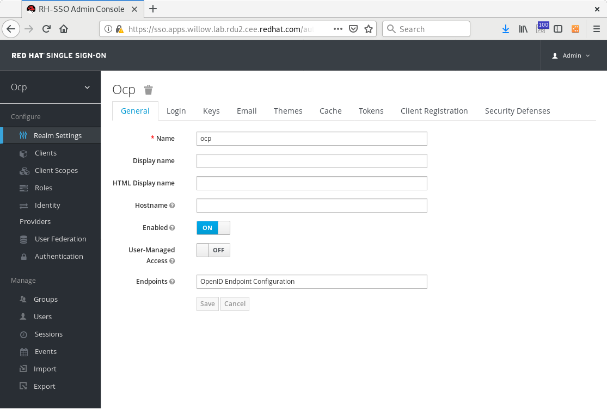
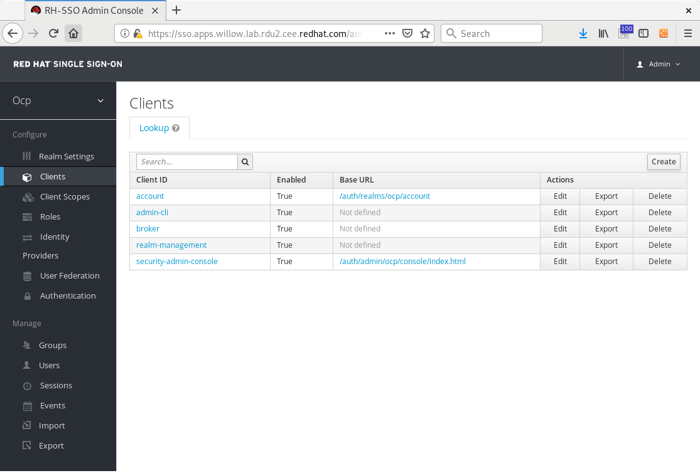
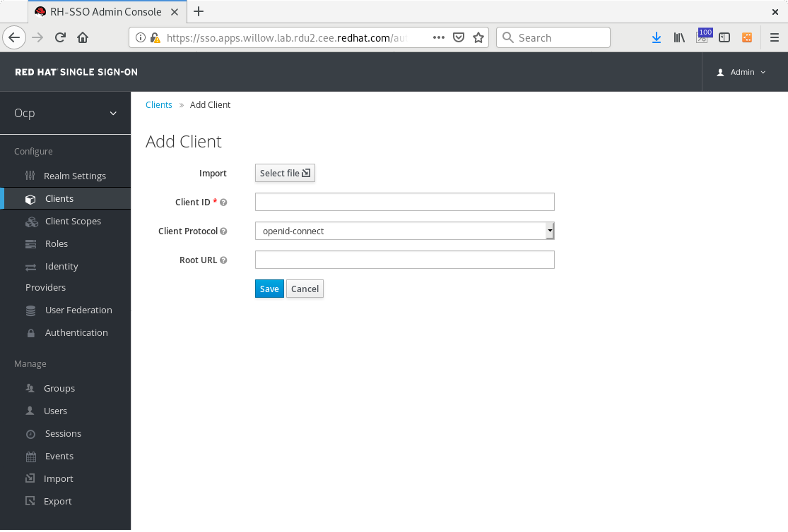
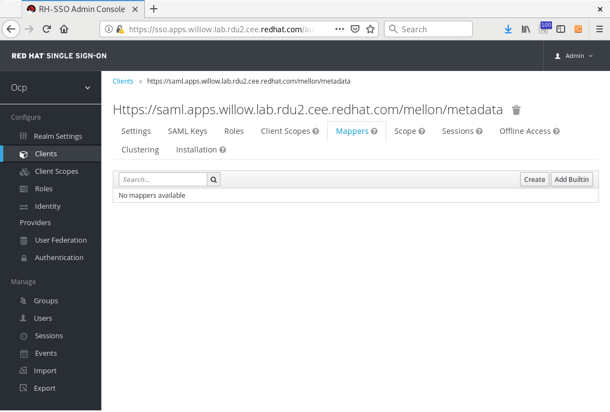
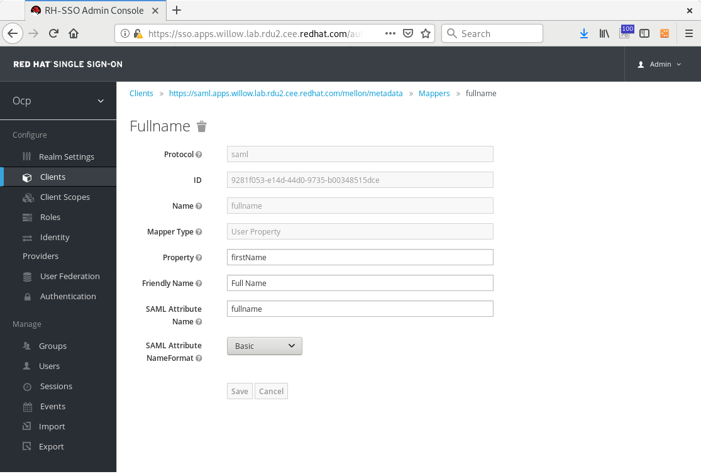
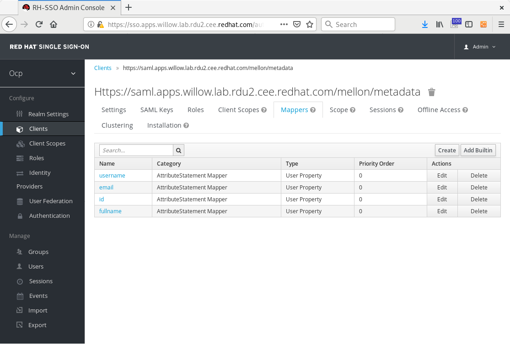
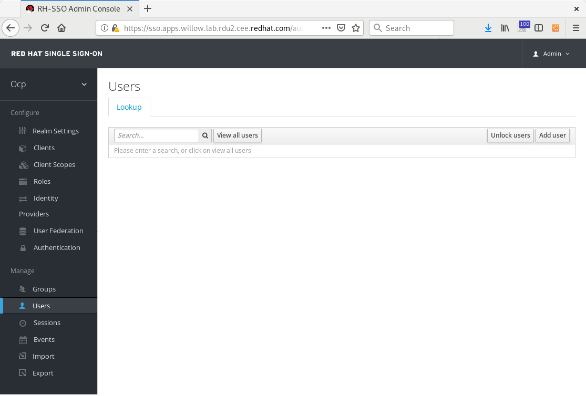
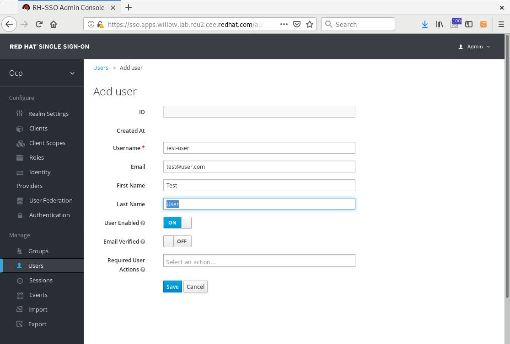
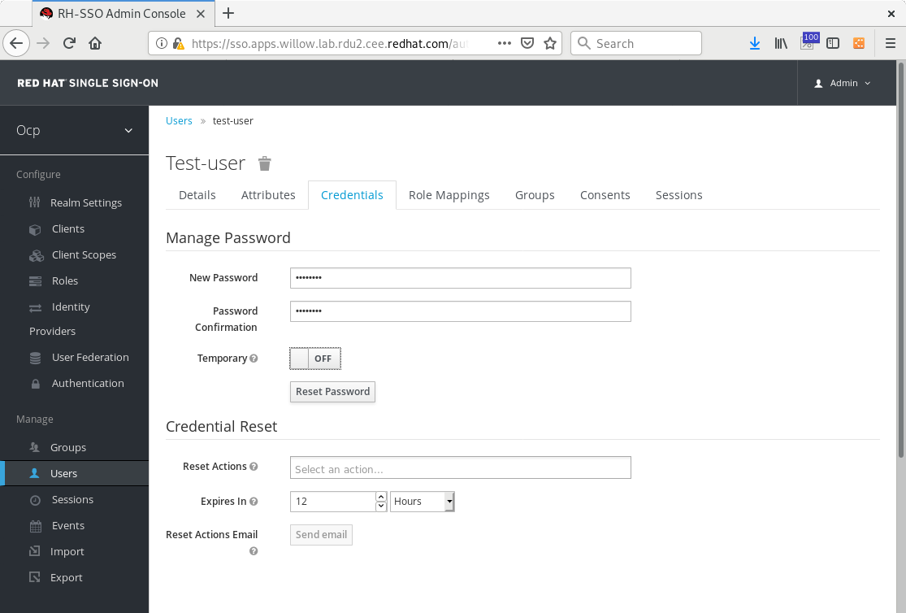

# request-header-saml-service-provider

* [Introduction](#introduction)
* [Set up your Environment](#set-up-your-environment)
* [Install RH-SSO on OpenShift (optional)](#install-rh-sso-on-openshift-optional)
* [Install the Apache Mellon Server on OpenShift](#install-the-apache-mellon-server-on-openshift)
* [Install SAML ServiceProvider Client on RH-SSO IdP (Optional)](#install-saml-serviceprovider-client-on-rh-sso-idp-optional)
* [Update the Master API Configuration](#update-the-master-api-configuration)
* [Update the Web Console Logout](#update-the-web-console-logout)
* [Debugging](#debugging)
* [Appendix](#appendix) 

## Introduction

This project sets up OpenShift [Request header](https://docs.openshift.com/container-platform/3.11/install_config/configuring_authentication.html#RequestHeaderIdentityProvider) authentication between a SAML IdP and OpenShift with mod_auth_mellon acting as a SAML Proxy.  There are Ansible playbooks available to roll the installs automatically, but be aware they are not resilient and you may need to modify them to work with your own environment.  Contributions and improvements are always welcome.  The playbook uses RH-SSO, built upon Keycloak, as an example IdP.  It would be great to spin up a test cluster just to practice these steps and understand how everything works, prior to attempting to integrate with another IdP.  The playbooks expect a minimal cluster install with the basic HTPasswd provider.

The high level communication flow that is created by implementing this solution is:
1. OCP Console
2. SAML Proxy SP
3. Your SAML IdP
4. SAML Proxy SP
5. OCP oAuth
6. OCP console

### Authentication not Authorization

This solution will implement SAML-based authentication for your OpenShift cluster. For authorization, the most common solution is [Syncing groups With LDAP](https://docs.openshift.com/container-platform/3.11/install_config/syncing_groups_with_ldap.html) and ensuring the `user` identity provided by your SAML IdP matches the user's identity in your LDAP.

### Proxy

This proxy is a solution to proxy ONLY the OpenShift OAuth login endpoint.  We do not recommend you proxy all OpenShift content requested from either the Master API or the Web Console.  That would not be a good idea because the proxy likely cannot pass all request types through correctly (websockets, SPDY).  The OpenShift OAuth provider should alone be responsible for the security of the platform.

### Ansible Automated Installs

**WARNING**: If running through the ansiblilized instructions be sure to run them against a test cluster before running against a cluster criticle to your operations. The same is also true of running through the manual steps, though when running through the manual steps you will have a clearly idea of which step broke your cluster and how vs the ansible steps which do all the work for you and do not come with reversing playbooks.

## Set up your Environment

### Set up environment variables

Setting these now will make running future steps much more of just a copy/paste exercise rather than more manual fill in the blank.

For the SAML Proxy:
```sh
SAML_CONFIG_DIR=/etc/origin/master/proxy
SAML_UTILITY_PROJECTS_DIR=/opt/request-header-saml-service-provider
SAML_PROXY_FQDN=saml.apps.ocp.example.com
SAML_PROXY_URL=https://${SAML_PROXY_FQDN}
SAML_OCP_PROJECT=ocp-saml-proxy
OPENSHIFT_MASTER_PUBLIC_URL=https://openshift.ocp.example.com
GIT_REPO=https://github.com/openshift/request-header-saml-service-provider
GIT_BRANCH=master
APPLICATION_DOMAIN=${SAML_PROXY_FQDN}
```

* `SAML_CONFIG_DIR` - directory to store all of your SAML configuration
* `SAML_UTILITY_PROJECTS_DIR` - directory to check out required upstream projects
* `SAML_PROXY_FQDN` - This will be the FQDN to your SAML proxy (Apache mod\_auth\_mellon), typically something like `saml.apps.ocp.example.com`.
* `SAML_PROXY_URL` - Derived from the above.  Do not edit.
* `SAML_OCP_PROJECT` - OpenShift project to store the SAML Proxy resources.
* `OPENSHIFT_MASTER_PUBLIC_URL` - OpenShift masters public URL. This is the URL you access the OpenShift console on. If using a port other than 443 then include `:PORT` as part of the URL.
* `GIT_REPO` - The git repo for this project
* `GIT_BRANCH` - The git branch you would like to check out.

For the test IdP RH-SSO:
```
APPLICATION_NAME=sso
SSO_HOSTNAME=sso.apps.ocp.example.com
SSO_URL=https://${SSO_HOSTNAME}
SSO_ADMIN_USERNAME=admin
SSO_ADMIN_PASSWORD=Pa55word1!
SSO_REALM=ocp
SSO_NAMESPACE=sso

IDP_SAML_METADATA_URL=${SSO_URL}/auth/realms/${SSO_REALM}/protocol/saml/descriptor
IDP_ADMIN_USER=admin
IDP_ADMIN_PASSWORD=RedHat1!
IDP_HOSTNAME=sso.apps.willow.lab.rdu2.cee.redhat.com
IDP_URL=https://${IDP_HOSTNAME}
IDP_APP_NAME=sso

SSO_NAMESPACE=sso
REMOTE_USER_SAML_ATTRIBUTE=id
REMOTE_USER_NAME_SAML_ATTRIBUTE=fullname
REMOTE_USER_EMAIL_SAML_ATTRIBUTE=email
REMOTE_USER_PREFERRED_USERNAME_SAML_ATTRIBUTE=username

OCP_REALM=ocp
REALM_TEST_USER=test-user
REALM_TEST_USER_PASSWORD=Pa55word1!
REALM_TEST_USER_EMAIL=me@go.com
REALM_TEST_USER_FIRSTNAME=Test
REALM_TEST_USER_LASTNAME=User
```

### Create place to store SAML config files and clone required utitility projects

```sh
mkdir -p ${SAML_CONFIG_DIR}
git clone ${GIT_REPO} ${SAML_UTILITY_PROJECTS_DIR} --branch ${GIT_BRANCH}
```

### Log into first master and SUDO to root

All of this will be done on your first OpenShift master. While doing work directly on an OpenShift master is typically discouraged, you need access to files that live on the first master to complete this procedure, you will also need to be root, or be able to sudo to root, to access the required files. 

If you choose to run the Ansible playbooks, you do not need to be logged in to the OpenShift master,  but your Ansible configuration should be setup to gain access to it.

### Set up Ansible Inventory for Automation

We recommend you setup your inventory based on the example provided and update the username, password, and URL fields as you need.  You may also want to provide an ``ansible.cfg`` file as well.  The ``inventory`` and ``ansible.cfg`` files are currently ignored by git.  

The playbooks should be run from a bastion, or jump, host outside of the cluster itself.

```
$ mv inventory.example inventory
```

Login to your OpenShift Client with a cluster-admin user

```
$ oc login https://openshift.ocp.example.com:443
```

### Get your IdP Provided metadata

If you are not using the test IdP in this project, your IdP administrator must provide you with your IdP metadata XML file. Information they will request from you will include but not necessarily be limited to:

* Your `ENTITY_ID`: the location of your metadata output
* Single Sign-On Service URL: https://SAML_PROXY_FQDN/mellon/postResponse
* Single Logout Service URL: https://SAML_PROXY_FQDN/mellon/logout
* Required attributes - The attributes to be provided by the IdP to the SP
  * `user` - Required. The unique user ID for the authenticating user. This should align with the LDAP server you plan to use for authorization, AKA [LDAP group sync](https://docs.openshift.com/container-platform/3.11/install_config/syncing_groups_with_ldap.html).
  * `name` - Optional. Human full name of the user. This is used for display purposes in the UI.
  * `email` - Optional. E-mail address of the user.
  * `preferred_username` - Optional. Preferred user name, if different than the immutable identity determined from the headers specified in headers.

Once received this file should be put in `${SAML_UTILITY_PROJECTS_DIR}/saml-service-provider/saml2/idp-metadata.xml`.  If you choose to deploy the test IdP, you will pull this in another step later.

## Install RH-SSO on OpenShift (optional)

This creates an instance of RH-SSO based off the 7.3 template, with no persistent volume.  This is for testing use only and none of your configuration will persist.  If your pod crashes or you destroy the pod, your certificates will be different and you will need to make adjustments to your work on the saml-auth server.  In this event, we recommend deleting everything, as in the "Clean Up" section below, and starting over.  If you already have an IdP, you could skip this step, but it might provide useful as an exercise for your understanding of how the SAML mappings work.


### Create project namespace

```
# oc new-project sso
```

### Run template install

```
# oc process -f ${SAML_UTILITY_PROJECTS_DIR}/rh-sso/sso73-x509-https.yaml \
        -p=APPLICATION_NAME=${APPLICATION_NAME} \
        -p=SSO_HOSTNAME=${SSO_HOSTNAME} \
        -p=SSO_ADMIN_USERNAME=${SSO_ADMIN_USERNAME} \
        -p=SSO_ADMIN_PASSWORD=${SSO_ADMIN_PASSWORD} \
        -p=SSO_REALM=${SSO_REALM} \
        | oc create -f-
```

Note that there is no persistent database backing this template.  This is for test purposes only and a pod restart will clear the app configuration.

### Automate this:

```
$ ansible-playbook playbooks/install-rh-sso.yaml
```

## Install the Apache Mellon Server on OpenShift

This creates an instance of an Apache HTTPD server with mod_auth_mellon installed, based off the current httpd24 image provided by the Red Hat Container Catalog.  If you need to debug your server, you can follow further steps in the `saml-service-provider/debug` folder.

### Create the server project namespace

```sh
oc new-project ${SAML_OCP_PROJECT} --description='SAML proxy for RequestHeader authentication to OpenShift. See https://github.com/openshift/request-header-saml-service-provider for more details.'
```

### Create Apache Conf ConfigMap

Mount your Mellon Specific apache settings.  If you need to further customize your apache configuration, you can update this ``openshift.conf`` file.  You may wish to use different RequestHeader names or provide additional configuration tweaks.  

```
oc create cm httpd-mellon-conf --from-file=${SAML_UTILITY_PROJECTS_DIR}/saml-service-provider/openshift.conf -n ${SAML_OCP_PROJECT}
```

### Create ServiceProvider SAML Metadata

This script generates metadata XML for your ServiceProvider, which is used by the Mellon library and is configured in your `openshift.conf` file.  You do not have to use the certificates generated here, but the generated XML outputs will give you an example of how to form your XMLdata and add your own certificates.

```sh
# Note, Secrets cannot have key names with an 'underscore' in them, so when
# creating metadata files with `mellon_create_metadata.sh` the resulting files
# must be renamed appropriately.
mellon_endpoint_url="${SAML_PROXY_URL}/mellon"
mellon_entity_id="${mellon_endpoint_url}/metadata"
file_prefix="$(echo "$mellon_entity_id" | sed 's/[^0-9A-Za-z.]/_/g' | sed 's/__*/_/g')"
${SAML_UTILITY_PROJECTS_DIR}/saml-service-provider/mellon_create_metadata.sh $mellon_entity_id $mellon_endpoint_url
mkdir ${SAML_CONFIG_DIR}/saml2
mv ${file_prefix}.cert ${SAML_CONFIG_DIR}/saml2/mellon.crt
mv ${file_prefix}.key ${SAML_CONFIG_DIR}/saml2/mellon.key
mv ${file_prefix}.xml ${SAML_CONFIG_DIR}/saml2/mellon-metadata.xml
```

Script taken from the mod_auth_mellon package containing the file `/usr/libexec/mod_auth_mellon/mellon_create_metadata.sh`, with documentation and instructions taken from:
- https://access.redhat.com/documentation/en-us/red_hat_single_sign-on/7.3/html-single/securing_applications_and_services_guide/#configuring_mod_auth_mellon_with_red_hat_single_sign_on
- https://www.keycloak.org/docs/latest/securing_apps/index.html#configuring-mod_auth_mellon-with-keycloak

Do not use the latest script from the public GitHub repository, as it is incompatible with RH-SSO without further modifications.  

### Pull IdP Metadata

If you deployed the RH-SSO instance, pull the IdP Metadata from the server.  If you have a different IdP, you may find you can execute a similar command.

```
curl -k -o ${SAML_CONFIG_DIR}/saml2/idp-metadata.xml ${IDP_SAML_METADATA_URL}
```

### Create ConfigMap of ServiceProvider and IdP Metadata

Create a ConfigMap to mount the certificates and metadata to the pods.

```
oc create cm httpd-saml2-config --from-file=${SAML_CONFIG_DIR}/saml2 -n ${SAML_OCP_PROJECT}
```

### Create OCP API Client Certficates

This certificate is used by the saml service provider pod to make a secure
request to the Master.  Using all the defaults, a suitable file can be created
as follows:

```sh
oc adm create-api-client-config \
  --certificate-authority='/etc/origin/master/ca.crt' \
  --client-dir=${SAML_CONFIG_DIR} \
  --signer-cert='/etc/origin/master/ca.crt' \
  --signer-key='/etc/origin/master/ca.key' \
  --signer-serial='/etc/origin/master/ca.serial.txt' \
  --user='system:proxy'

cat ${SAML_CONFIG_DIR}/system\:proxy.crt ${SAML_CONFIG_DIR}/system\:proxy.key > ${SAML_CONFIG_DIR}/authproxy.pem
oc create secret generic httpd-ose-certs-secret --from-file=${SAML_CONFIG_DIR}/authproxy.pem --from-file=/etc/origin/master/proxy/ca.crt -n ${SAML_OCP_PROJECT}
```

Technically speaking you can provide your own certificate in similar format, however, the CA file must be provided in the Oauth configuration of the OpenShift Master configuration.

### Create SAML Proxy Client Certificates

The saml service provider pod will itself expose a TLS endpoint.  The OpenShift
Router will use TLS passthrough to allow it to terminate the connection.

__NOTE__: These instructions use the OCP CA to sign the cert. The other option is to get your own signed certificate. It is recomended you get an organizationally trusted CA to sign this certifcate for production use, otherwise users will see their browsers prompting them to accept this certificate when they try to log in via SAML.

Here you can use the `oc` tool to provision these certificates, but you could also use other libraries such as `openssl`.

```sh
oc adm ca create-server-cert \
  --signer-cert='/etc/origin/master/ca.crt' \
  --signer-key='/etc/origin/master/ca.key' \
  --signer-serial='/etc/origin/master/ca.serial.txt' \
  --hostnames=${SAML_PROXY_FQDN} \
  --cert=${SAML_CONFIG_DIR}/httpd.pem \
  --key=${SAML_CONFIG_DIR}/httpd-key.pem

oc create secret generic httpd-server-cert-secret --from-file=${SAML_CONFIG_DIR}/httpd.pem -n ${SAML_OCP_PROJECT}
oc create secret generic httpd-server-key-secret --from-file=${SAML_CONFIG_DIR}/httpd-key.pem -n ${SAML_OCP_PROJECT}
oc create secret generic httpd-server-ca-cert-secret --from-file=/etc/origin/master/ca.crt -n ${SAML_OCP_PROJECT}
```

### Create ServerName ConfigMap

This replaces the ServerName field with your defined FQDN and port from an environment variable.

```
oc create cm server-name-script --from-file ${SAML_UTILITY_PROJECTS_DIR}/saml-service-provider/50-update-ServerName.sh -n ${SAML_OCP_PROJECT}
```

### Deploying SAML Proxy

```sh
oc process -f ${SAML_UTILITY_PROJECTS_DIR}/saml-auth-template.yml \
  -p=OPENSHIFT_MASTER_PUBLIC_URL=${OPENSHIFT_MASTER_PUBLIC_URL} \
  -p=PROXY_PATH=/oauth \
  -p=PROXY_DESTINATION=${OPENSHIFT_MASTER_PUBLIC_URL}/oauth \
  -p=APPLICATION_DOMAIN=${APPLICATION_DOMAIN} \
  -p=REMOTE_USER_SAML_ATTRIBUTE=${REMOTE_USER_SAML_ATTRIBUTE} \
  -p=REMOTE_USER_NAME_SAML_ATTRIBUTE=${REMOTE_USER_NAME_SAML_ATTRIBUTE} \
  -p=REMOTE_USER_EMAIL_SAML_ATTRIBUTE=${REMOTE_USER_EMAIL_SAML_ATTRIBUTE} \
  -p=REMOTE_USER_PREFERRED_USERNAME_SAML_ATTRIBUTE=${REMOTE_USER_PREFERRED_USERNAME_SAML_ATTRIBUTE} \
  | oc create -f- -n ${SAML_OCP_PROJECT}
```

The template defines replicas as 1.  This pod can be scaled to multiple replicas for high availability. During testing it is recomended to remain at 1 replicate to make debugging easier.

```sh
oc scale --replicas=2 dc saml-auth
```

### Test SAML Proxy
At this point you should be able to download your SP client metadata from the Apache mod_auth_mellon server.

Verify your `mellon-metadata.xml` downloads:

```
curl -k https://${SAML_PROXY_FQDN}/mellon/metadata
```

### Automate This:

```
$ ansible-playbook playbooks/install-saml-auth.yaml
```


## Install SAML ServiceProvider Client on RH-SSO IdP (Optional)

If you chose to install the RH-SSO IdP in the previous steps, you will need to configure the saml-auth Client for the corresponding authentication Realm.  This also installs a test-user account in the realm.

Note: because we are adding a configmap to the SSO deploymentconfig, a new instance rolls out with the update.  This in turn requires a configmap update to the saml-auth server.  When debugging, be sure both sides have the correct updates to all certificates.

### Create the client in RH-SSO

Create a new client by importing the ServiceProvider metadata that was output in the previous steps.  

When you login, you should be taken to the realm created automatically by the OpenShift Template.  You can verify it is labeled the same as your realm name chosen, on the left side of the UI.  



* Click on "Clients" on the left side of the window.



* Click on "Create" on the right side of the window.



* Click on "Select file" next to the "Import" field and select the mellon-metadata.xml produced by the script in the above steps.  You may need to copy this file over to your local machine from the master where you created it.


* Click "Save".


### Create Mappings

* From the Client you just created, click "Mappers" along the top tabs.  



* Click "Create". 
* Choose "Mapper Type" : "User Property". 
* Fill in the fields as shown for all four Mappers.






Note that this demo uses a Mapper for ``REMOTE_USER_NAME_SAML_ATTRIBUTE=fullname`` where ``fullname`` only maps to ``firstName`` from RH-SSO.  The existing Keycloak SAML attribute Mappers do not have a simple way of concatenating the user's ``firstName`` and ``lastName`` attributes without writing a custom Keycloak script.  

### Add a test user and set the user's password

* Click "Users" on the left side of the window.



* Click "Add user" on the right side of the window.



* Enter user details as needed.
* Click "Save".
* On the user entry you just created, click "Credentials" tab across the top of the window.
Reset the user password, selecting "Temporary" = "Off".



### Create the client, mappings, and test user in a scripted fashion

Notes: DO NOT perform these steps if you performed the manual steps above.  Also, you will need `jq` which is available in EPEL7.  

Get an access token for the API, then make a call to convert the mellon-metadata.xml into an RH-SSO Client object.
Finally, merge custom prewritten mappings into the Client object to make it ready to call the API create client function.

```
access_token=`curl -k -d "client_id=admin-cli" -d "username=${IDP_ADMIN_USER}" --data-urlencode "password=${IDP_ADMIN_PASSWORD}" -d "grant_type=password" "${IDP_URL}/auth/realms/master/protocol/openid-connect/token"| jq -r '.access_token'`
curl -k -v \
    -H "Authorization: bearer $access_token" \
    -H "Content-Type: application/json;charset=utf-8" \
    --data "@${SAML_CONFIG_DIR}/saml2/mellon-metadata.xml" \
    ${IDP_URL}/auth/admin/realms/${OCP_REALM}/client-description-converter > ${SAML_CONFIG_DIR}/saml2/mellon-idp-client.json
jq -s '.[0] * .[1]' ${SAML_CONFIG_DIR}/saml2/mellon-idp-client.json ${SAML_UTILITY_PROJECTS_DIR}/rh-sso/idp-mappers.json > ${SAML_CONFIG_DIR}/saml2/mellon-idp-client-with-mappers.json
```

Upload client json to config map, as we need to make the next calls from within the container:

```
oc create cm mellon-rh-sso-client --from-file=${SAML_CONFIG_DIR}/saml2/mellon-idp-client-with-mappers.json -n ${SSO_NAMESPACE}
```

Mount configmap volume:

```
oc set volume dc/sso -n ${SSO_NAMESPACE} --add --name=mellon-rh-sso-client --mount-path=/mellon-client --type=configmap --configmap-name=mellon-rh-sso-client --overwrite
```

After waiting for the pod to restart from the above volume mount, execute these commands to run inside the container itself:

```
POD_NAME=`oc get pods -n ${SSO_NAMESPACE} | grep -e "sso.*Running" | head -1 | awk '{print $1}'`
TRUSTSTORE_PASSWORD=`oc rsh -n ${SSO_NAMESPACE} $POD_NAME xmllint --xpath "string(/*[namespace-uri()='urn:jboss:domain:8.0' and local-name()='server']/*[namespace-uri()='urn:jboss:domain:8.0' and local-name()='profile']/*[namespace-uri()='urn:jboss:domain:keycloak-server:1.1' and local-name()='subsystem']/*[namespace-uri()='urn:jboss:domain:keycloak-server:1.1' and local-name()='spi' and @name='truststore']/*[namespace-uri()='urn:jboss:domain:keycloak-server:1.1' and local-name()='provider' and @name='file']/*[namespace-uri()='urn:jboss:domain:keycloak-server:1.1' and local-name()='properties']/*[local-name()='property' and @name='password']/@value)" /opt/eap/standalone/configuration/standalone-openshift.xml`
oc rsh -n ${SSO_NAMESPACE} $POD_NAME /opt/eap/bin/kcadm.sh config truststore --trustpass $TRUSTSTORE_PASSWORD /opt/eap/keystores/truststore.jks
oc rsh -n ${SSO_NAMESPACE} $POD_NAME /opt/eap/bin/kcadm.sh config credentials --server https://${IDP_APP_NAME}.${SSO_NAMESPACE}.svc:8443/auth --realm master --user ${IDP_ADMIN_USER} --password ${IDP_ADMIN_PASSWORD}
oc rsh -n ${SSO_NAMESPACE} $POD_NAME /opt/eap/bin/kcadm.sh create clients -r ${OCP_REALM} -f /mellon-client/mellon-idp-client-with-mappers.json
oc rsh -n ${SSO_NAMESPACE} $POD_NAME /opt/eap/bin/kcadm.sh create users -r ${OCP_REALM} -s username=${REALM_TEST_USER} -s enabled=true -s email=${REALM_TEST_USER_EMAIL} -s firstName=${REALM_TEST_USER_FIRSTNAME} -s lastName=${REALM_TEST_USER_LASTNAME} -o --fields id,username
oc rsh -n ${SSO_NAMESPACE} $POD_NAME /opt/eap/bin/kcadm.sh set-password -r ${OCP_REALM} --username ${REALM_TEST_USER} --new-password ${REALM_TEST_USER_PASSWORD}
```

Update configmap with new idp data (restart created new)

```
curl -k -o ${SAML_CONFIG_DIR}/saml2/idp-metadata.xml ${IDP_SAML_METADATA_URL}
oc delete cm httpd-saml2-config -n ${SAML_OCP_PROJECT}
oc create cm httpd-saml2-config --from-file=${SAML_CONFIG_DIR}/saml2 -n ${SAML_OCP_PROJECT}
oc rollout latest dc/saml-auth -n ${SAML_OCP_PROJECT}
```

### Automate This:

```
$ ansible-playbook playbooks/install-rh-sso-client.yaml
```

Note: because we are adding a configmap to the SSO deploymentconfig, a new instance rolls out with the update.  This in turn requires a configmap update to the saml-auth server.  When debugging, be sure both sides have the correct updates to all certificates.


## Update the Master API Configuration

This configures the OAuth OpenShift Provider to Proxy to your SAML Proxy provider, which in turn proxies to your IdP.  Be sure your RequestHeader fields used here match those in your saml-auth openshift.conf file.

The following changes need to take place on the `/etc/origin/master/master-config.yaml` on all masters. 

You will need to do the string replacements yourself!

```yaml
oauthConfig:
...
  identityProviders:
  - name: SAML
    challenge: false
    login: true
    mappingMethod: add
    provider:
      apiVersion: v1
      kind: RequestHeaderIdentityProvider
      loginURL: "https://${SAML_PROXY_FQDN}/oauth/authorize?${query}"
      clientCA: /etc/origin/master/ca.crt
      headers:
      - X-Remote-User
      - Remote-User
      emailHeaders:
      - X-Remote-User-Email
      - Remote-User-Email
      nameHeaders:
      - X-Remote-User-Display-Name
      - Remote-User-Display-Name
      - X-Remote-User-Name
      - Remote-User-Name
      preferredUsernameHeaders:
      - X-Remote-User-Preferred-Username
      - Remote-User-Preferred-Username
  masterCA: ca-bundle.crt
...

```

For clusters < 3.9 update this entry in master-config.yaml as well:

```yaml
assetConfig:
  logoutURL: "https://SAML_PROXY_FQDN/mellon/logout?ReturnTo=https://SAML_PROXY_FQDN/logged_out.html"
```

Restart the master(s) at this point for the configuration to take effect.

For clusters < 3.10:

```
atomic-openshift-master-api
```

For cluster >= 3.10:

```
/usr/local/bin/master-restart api
```

### Automate This:

```
$ ansible-playbook playbooks/install-oauth-on-master.yaml
```

## Update the Web Console Logout

This is written ONLY for OCP 3.9 and above.  For lower, you need to update the assetConfig entries in the master-config.yaml.

```
oc get cm webconsole-config -n openshift-web-console -o yaml --export > webconsole-config.yaml
```

Be sure this value is set, with your variables expanded: 

  logoutPublicURL: '${SAML_PROXY_URL}/mellon/logout?ReturnTo=${SAML_PROXY_URL}/login-ocp'

oc export cm webconsole-config -n openshift-web-console -o yaml > webconsole-config.yaml

oc apply -f webconsole-config.yaml -n openshift-web-console

### Automate This:

```
$ ansible-playbook playbooks/update-webconsole-cm.yaml
```

# Debugging

## Revert the Master API Configuration

Use this in the event you need to rollback to the HTPasswd provider.

```
$ ansible-playbook playbooks/revert-oauth-on-master.yaml
```

## Clean up Resources

```
rm -rf ${SAML_CONFIG_DIR}
rm -rf ${SAML_UTILITY_PROJECTS_DIR}rm -rf ${SAML_UTILITY_PROJECTS_DIR}
oc delete project ocp-saml-proxy
oc delete project sso
oc delete is redhat-sso73-openshift -n openshift
oc delete user test-user
oc delete identity `oc get identities | grep test-user | awk '{print $1}'`
```

Note: this does not revert changes on your web console config.


## Making changes to secrets

It's likely you will need to update the value of some secrets.  To do this
simply delete the secret and recreate it.  Then trigger a new deployment.

```sh
oc project ${SAML_OCP_PROJECT}
oc delete secret <secret name>
oc create secret generic <secret name> --from-file=<path>
oc rollout latest saml-auth
```


## Using the debug image

This project builds the base deployment from the Red Hat supported httpd24 image found in the Red Hat Container Catalog.  It also provides a helpful, but custom, debug image if needed.  Please see the ``saml-service-provider/debug/README.adoc`` for more instructions on using it. It is very important to note this debug image should only be used during debuging and should not be used when going live in "production".

The debug image enables `mod_auth_mellon-diagnostics` and `mod_dumpio` both of which reduce performance and output security senstive logs you would not normally want in a production setting.

To use the debug image:

```sh
oc project ${SAML_OCP_PROJECT}
oc set triggers dc/saml-auth --containers=saml-auth --from-image=httpd-debug:latest 
```

To go back to the non-debug image:
```sh
oc project ${SAML_OCP_PROJECT}
oc set triggers dc/saml-auth --containers=saml-auth --from-image=openshift/httpd:latest 
```

## Common Issues
Common issues you will run into while getting this to work.

### NameIDFormat
By default when you [Generate SP SAML Metadata](#generate-sp-saml-metadata) from the `mellon_create_metadata.sh` script there is no `NameIDFormat` specified. Apache [mod_auth_mellon](https://github.com/Uninett/mod_auth_mellon/blob/master/doc/user_guide/mellon_user_guide.adoc#485-how-do-you-specify-the-nameid-format-in-saml) defaults to a setting of `transient`. This `transient` setting is a good default for our SAML proxy, as it allows the server to define every visitor with a unique ID prior to establishing any ID context from your IdP.  You will probably not, however, want to use this field as any mapped value to OpenShift.  If your IdP is expecting a different setting then you could end up with errors, most likely presenting your IdP error logs.

If there is a mismatch, then update your `saml-sp.xml` with the correct `NameIDFormat` and [recreate](#making-changes-to-secrets) the `httpd-saml-config-secret` secret.

For more information on `NameIDFormat` see the mod_auth_mellon doc [4.8.5. How do you specify the NameID format in SAML?](https://github.com/Uninett/mod_auth_mellon/blob/master/doc/user_guide/mellon_user_guide.adoc#485-how-do-you-specify-the-nameid-format-in-saml).

### IdP Attribute Mapping
The variables `REMOTE_USER_SAML_ATTRIBUTE`, `REMOTE_USER_NAME_SAML_ATTRIBUTE`, `REMOTE_USER_EMAIL_SAML_ATTRIBUTE`, and `REMOTE_USER_PREFERRED_USERNAME_SAML_ATTRIBUTE` should allow you to arbitrarly set what the IdP attribute names are for those fields and map them accordingly to the RequestHeaders.

These are the defaults for this project:

* `REMOTE_USER_SAML_ATTRIBUTE=user` - Required. The unique user ID for the authenticating user. This should align with the LDAP server you plan to use for authorization, AKA LDAP group sync.
* `REMOTE_USER_NAME_SAML_ATTRIBUTE=fullname` - Optional. Human full name of the user. This is used for display purposes in the UI.
* `REMOTE_USER_EMAIL_SAML_ATTRIBUTE=email` - Optional. E-mail address of the user.
* `REMOTE_USER_PREFERRED_USERNAME_SAML_ATTRIBUTE=preferred_username` - Optional. Preferred user name, if different than the immutable identity determined from the headers specified in headers.

If there is an issue with attributes being matched correctly you could end up seeing:

* infinite redirect loop between OCP oAuth and SAML Proxy

### clientCA not the CA that signed your SAML Proxy client certificates
If the `clientCA` value set in the [OpenShift master configuration changes](#openshift-master-configuration-changes) step is not the CA that signed the [Create SAML Proxy Client Certificates](#create-saml-proxy-client-certificates) then you could see an infinite redirect between OpenShift oAuth and SAML Proxy or other certificate errors in the browser or various logs.

### User Attributes Missing or Incorrect
Symptoms:
Logging into Openshift with the SAML provider will have a 403 Forbidden Error.
On the saml-auth pod (only the debug version) running on Openshift, you will see this line in `/etc/httpd/conf.d/mellon_diagnostics`
`am_check_permissions processing condition 0 of 1: varname="user" flags=[REG] str=".+" directive="MellonCond user .+ [REG]" failed (no OR condition) returning HTTP_FORBIDDEN`
This error is an indication that your SAML mappings coming from your IdP are not mapping correctly. The SAML property needs to be mapped as "user".

## Reducing Debug Footprint
While debuging it is helpful if you reduce the places you need to look for logs. It is then suggested that you:

1. scale the `saml-auth` service to 1 pod so there is only one place for SAML Proxy logs
2. update your load balancer for the OpenShift `masterURL` and `masterPublicURL` to only your first OpenShift master so there is only one OpenShift master to monitor for logs

## Debug logs
Helpful logs to look at while debuging.

### SAML Proxy Container
This is assuming you are using the debug image.

* `/etc/httpd/conf.d/mellon_diagnostics`
  * contains the output of `mod_auth_mellon-diagnostics`
* stdout
  * contains the output of `mod_dumpio` plus other helpful logs
  * helpful for knowing if OCP Console is at least redirecting to SAML Proxy correctly

### OpenShift Master
It helps if first you follow [Reducing Debug Footprint](#reducing-debug-footprint) so there is only one OpenShift master set of logs to look at.

* `journalctl -lafu atomic-openshift-master-api | tee > /tmp/master-api-logs`
  * useful for debuging the communication between OCP oAuth and SAML Proxy
  
### IdP
It can not be stressed enough the importance of having your local IdP administrator be involved with your debuging efforts. The speed at which you can resolve issues is expontential if you can have them monitoring the IdP logs at the same time you are doing your initial testing and reporting back what errors they see, and or, even better, screen sharing those logs with you.


# Appendix
## Terms
Helpful terms and their defintions used throughout this document.

| Term       | Meaning
|------------|--------
| SP         | Service Provider
| IdP        | Identity Provider
| SAML Proxy | The Apache mod\_mellon\_saml container deployed by these instructions to proxy the SAML communication from your IdP to OpenSHift via the RequestHeader Authentication OpenShift oAuth provider. In the context of the SAML communication the SAML proxy is also the SP even though it is acting as a go between for OpenShift.
