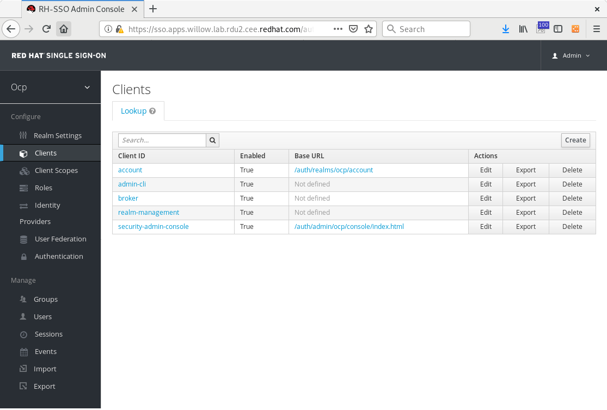
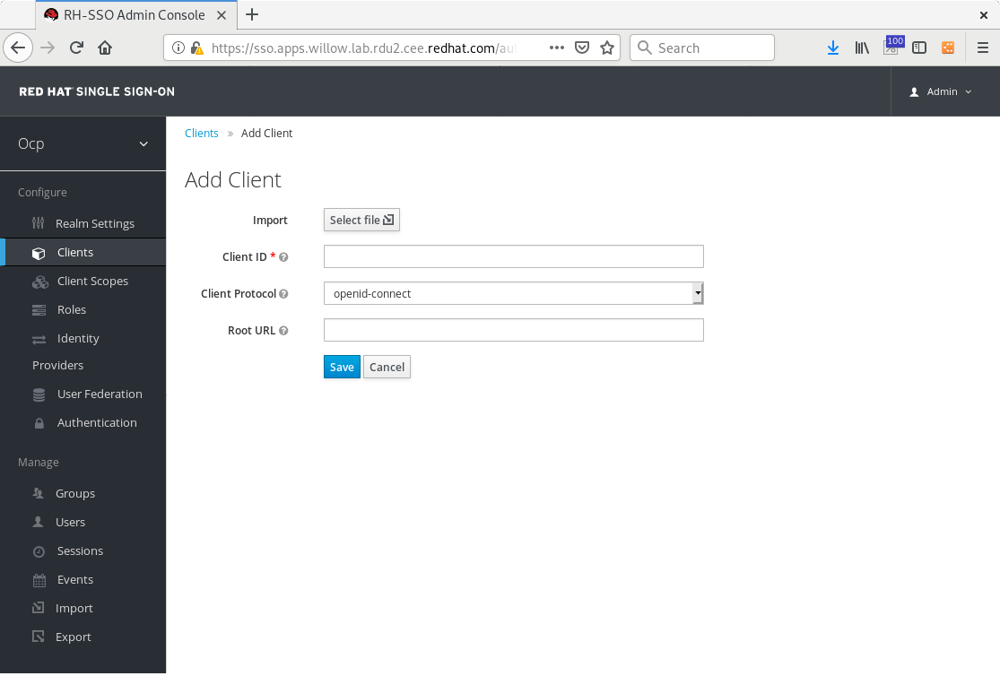
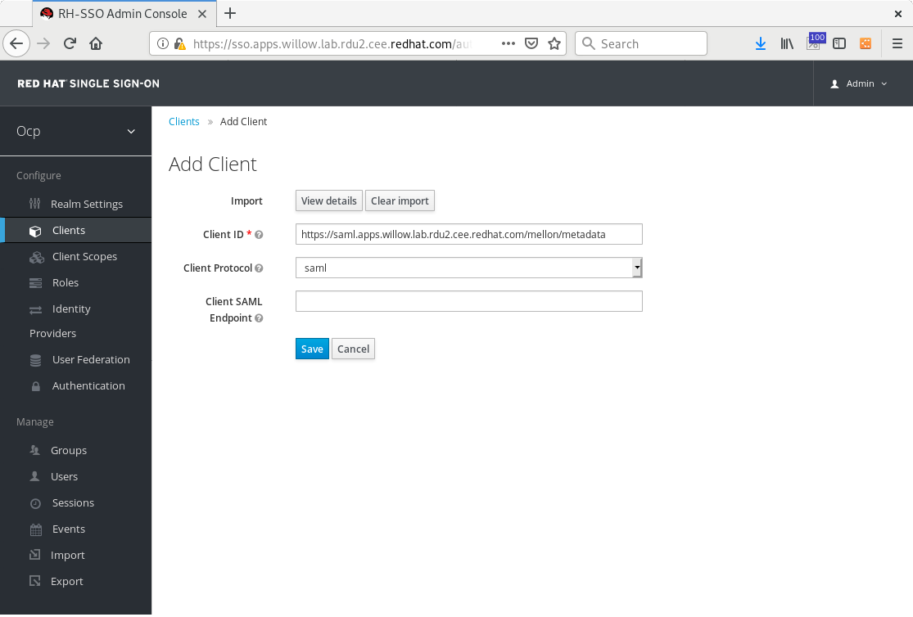
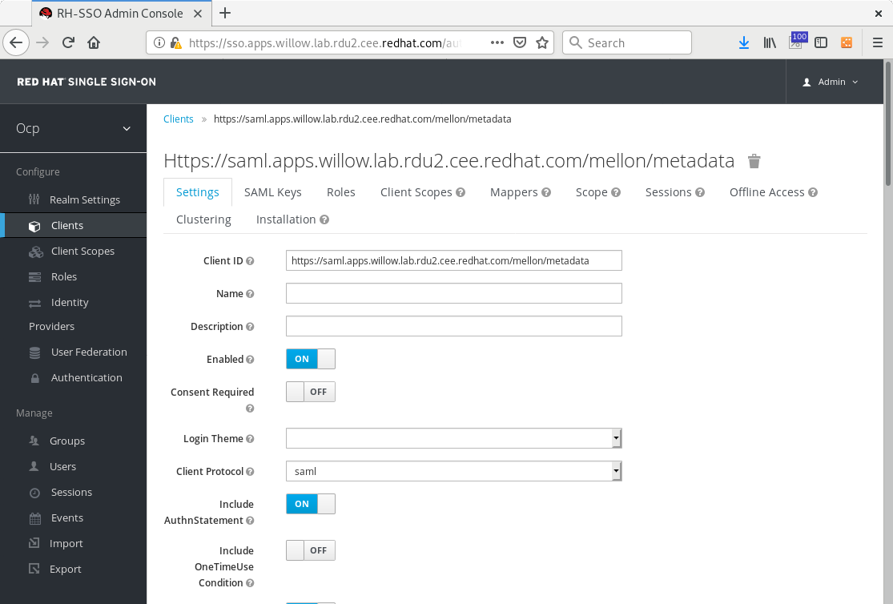
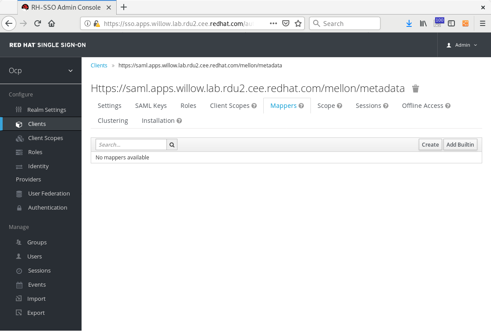
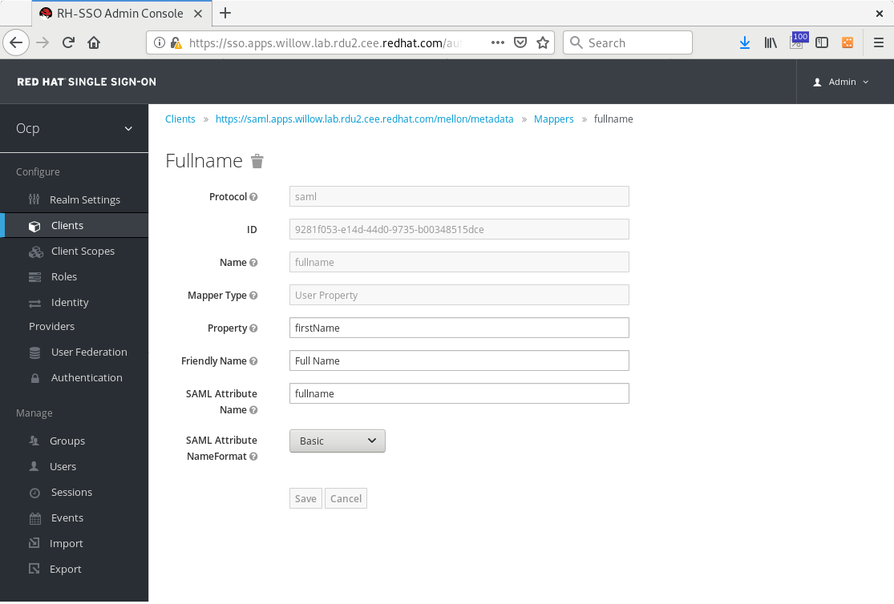
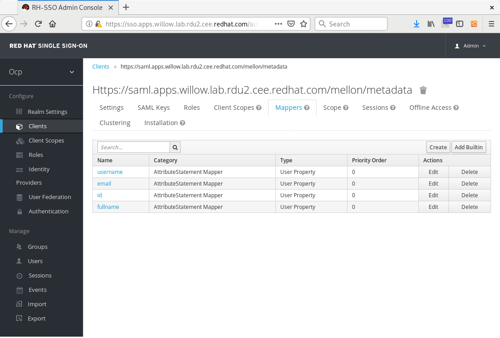
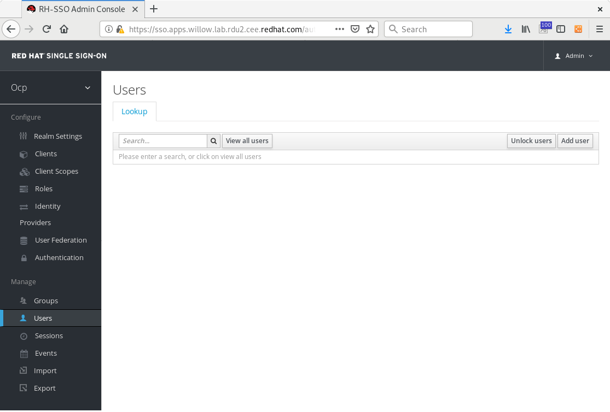
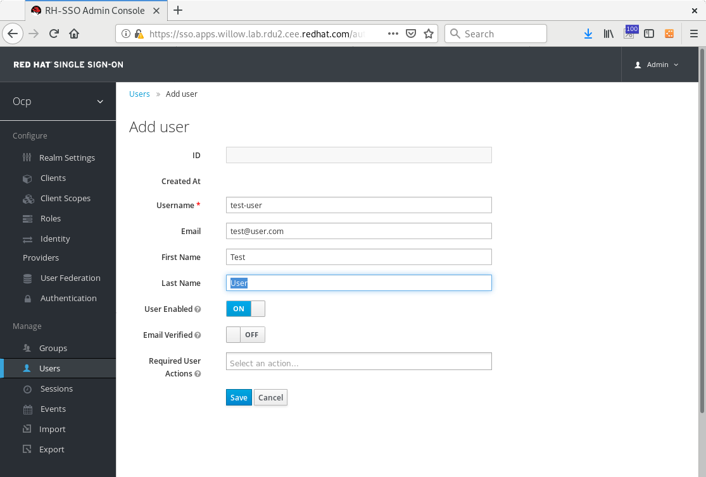
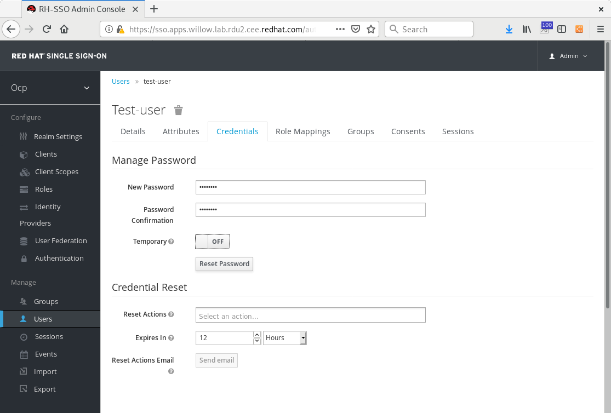

# Red Hat Single Sign On - Install

* [Introduction](#introduction)
* [Warning](#warning)
* [Setup](#setup)
* [Install RH-SSO](#install-rh-sso)
* [Install SAML ServiceProvider Client](#install-saml-serviceprovider-client)

## Introduction

If the enviornment you are testing this in does not already have a SAML Identity Provider this document inclues instructions for deploying a conterized instance of Red Hat Single Sign On (upstream Keycloak) to test aginst.

## Warning

**WARNING**: The RH-SSO install and instructions provided here are not intended for produciton use and are intended for sandbox testing fo the SAML proxy intigration only.

## Setup

### Create place to store SAML config files and clone required utitility projects

```sh
mkdir -p ${SAML_CONFIG_DIR}
git clone ${GIT_REPO} ${SAML_UTILITY_PROJECTS_DIR} --branch ${GIT_BRANCH}
```

### Option 1: Ansible

#### Create Ansible Inventory

We recommend you setup your inventory based on the example provided and update the username, password, and URL fields as you need.  You may also want to provide an ``ansible.cfg`` file as well.  The ``inventory`` and ``ansible.cfg`` files are currently ignored by git.

The playbooks should be run from a bastion, or jump, host outside of the cluster itself.

```
mv inventory.example inventory
```

| Variable                      | Description
|-------------------------------|------------
| `TODO`                        | TODO

### Login to OpenShift

Login to your OpenShift Client with a cluster-admin user from the system you will be running the playbooks from

```
oc login https://openshift.ocp.example.com:443
```

### Option 2: Manual

#### Set environment variables

Setting these now will make running future steps much more of just a copy/paste exercise rather than more manual fill in the blank.

```sh
APPLICATION_NAME=sso
SSO_HOSTNAME=sso.apps.ocp.example.com
SSO_URL=https://${SSO_HOSTNAME}
SSO_ADMIN_USERNAME=admin
SSO_ADMIN_PASSWORD=Pa55word1!
SSO_REALM=ocp
SSO_NAMESPACE=sso

IDP_SAML_METADATA_URL=${SSO_URL}/auth/realms/${SSO_REALM}/protocol/saml/descriptor
IDP_ADMIN_USER=admin
IDP_ADMIN_PASSWORD=RedHat1!
IDP_HOSTNAME=sso.apps.willow.lab.rdu2.cee.redhat.com
IDP_URL=https://${IDP_HOSTNAME}
IDP_APP_NAME=sso

SSO_NAMESPACE=sso
REMOTE_USER_SAML_ATTRIBUTE=id
REMOTE_USER_NAME_SAML_ATTRIBUTE=fullname
REMOTE_USER_EMAIL_SAML_ATTRIBUTE=email
REMOTE_USER_PREFERRED_USERNAME_SAML_ATTRIBUTE=username

OCP_REALM=ocp
REALM_TEST_USER=test-user
REALM_TEST_USER_PASSWORD=Pa55word1!
REALM_TEST_USER_EMAIL=me@go.com
REALM_TEST_USER_FIRSTNAME=Test
REALM_TEST_USER_LASTNAME=User
```

| Variable                      | Description
|-------------------------------|------------
| `TODO`                        | TODO

#### Log into first master and SUDO to root

All of this will be done on your first OpenShift master. While doing work directly on an OpenShift master is typically discouraged, you need access to files that live on the first master to complete this procedure, you will also need to be root, or be able to sudo to root, to access the required files. 

If you choose to run the Ansible playbooks, you do not need to be logged in to the OpenShift master,  but your Ansible configuration should be setup to gain access to it.


## Install RH-SSO

This creates an instance of RH-SSO based off the 7.3 template, with no persistent volume.  This is for testing use only and none of your configuration will persist.  If your pod crashes or you destroy the pod, your certificates will be different and you will need to make adjustments to your work on the saml-auth server.  In this event, we recommend deleting everything, as in the "Clean Up" section below, and starting over.  If you already have an IdP, you could skip this step, but it might provide useful as an exercise for your understanding of how the SAML mappings work.

### Option 1: Ansible

```sh
ansible-playbook playbooks/install-rh-sso.yaml
```

### Option 2: Manaul

#### Create project namespace

```sh
oc new-project sso
```

#### Run template install

```sh
oc process -f ${SAML_UTILITY_PROJECTS_DIR}/rh-sso/sso73-x509-https.yaml \
  -p=APPLICATION_NAME=${APPLICATION_NAME} \
  -p=SSO_HOSTNAME=${SSO_HOSTNAME} \
  -p=SSO_ADMIN_USERNAME=${SSO_ADMIN_USERNAME} \
  -p=SSO_ADMIN_PASSWORD=${SSO_ADMIN_PASSWORD} \
  -p=SSO_REALM=${SSO_REALM} \
  | oc create -f-
```

Note that there is no persistent database backing this template.  This is for test purposes only and a pod restart will clear the app configuration.


## Install SAML ServiceProvider Client

If you chose to install the RH-SSO IdP in the previous steps, you will need to configure the saml-auth Client for the corresponding authentication Realm.  This also installs a test-user account in the realm.

__Note__: because we are adding a configmap to the SSO deploymentconfig, a new instance rolls out with the update.  This in turn requires a configmap update to the saml-auth server.  When debugging, be sure both sides have the correct updates to all certificates.

### Option 1: Ansible

```sh
ansible-playbook playbooks/install-rh-sso-client.yaml
```

### Option 2: Manual

#### Create the client in RH-SSO

Create a new client by importing the ServiceProvider metadata that was output in the previous steps.  

When you login, you should be taken to the realm created automatically by the OpenShift Template.  You can verify it is labeled the same as your realm name chosen, on the left side of the UI.  


* Click on "Clients" on the left side of the window.



* Click on "Create" on the right side of the window.



* Click on "Select file" next to the "Import" field and select the mellon-metadata.xml produced by the script in the above steps.  You may need to copy this file over to your local machine from the master where you created it.



* Click "Save".



#### Create Mappings

* From the Client you just created, click "Mappers" along the top tabs.  



* Click "Create". 
* Choose "Mapper Type" : "User Property". 
* Fill in the fields as shown for all four Mappers.






Note that this demo uses a Mapper for ``REMOTE_USER_NAME_SAML_ATTRIBUTE=fullname`` where ``fullname`` only maps to ``firstName`` from RH-SSO.  The existing Keycloak SAML attribute Mappers do not have a simple way of concatenating the user's ``firstName`` and ``lastName`` attributes without writing a custom Keycloak script.  

#### Add a test user and set the user's password

* Click "Users" on the left side of the window.



* Click "Add user" on the right side of the window.



* Enter user details as needed.
* Click "Save".
* On the user entry you just created, click "Credentials" tab across the top of the window.
Reset the user password, selecting "Temporary" = "Off".



#### Create the client, mappings, and test user in a scripted fashion

Notes: DO NOT perform these steps if you performed the manual steps above.  Also, you will need `jq` which is available in EPEL7.  

Get an access token for the API, then make a call to convert the mellon-metadata.xml into an RH-SSO Client object.
Finally, merge custom prewritten mappings into the Client object to make it ready to call the API create client function.

```sh
access_token=`curl -k -d "client_id=admin-cli" -d "username=${IDP_ADMIN_USER}" --data-urlencode "password=${IDP_ADMIN_PASSWORD}" -d "grant_type=password" "${IDP_URL}/auth/realms/master/protocol/openid-connect/token"| jq -r '.access_token'`
curl -k -v \
    -H "Authorization: bearer $access_token" \
    -H "Content-Type: application/json;charset=utf-8" \
    --data "@${SAML_CONFIG_DIR}/saml2/mellon-metadata.xml" \
    ${IDP_URL}/auth/admin/realms/${OCP_REALM}/client-description-converter > ${SAML_CONFIG_DIR}/saml2/mellon-idp-client.json
jq -s '.[0] * .[1]' ${SAML_CONFIG_DIR}/saml2/mellon-idp-client.json ${SAML_UTILITY_PROJECTS_DIR}/rh-sso/idp-mappers.json > ${SAML_CONFIG_DIR}/saml2/mellon-idp-client-with-mappers.json
```

Upload client json to config map, as we need to make the next calls from within the container:

```sh
oc create cm mellon-rh-sso-client --from-file=${SAML_CONFIG_DIR}/saml2/mellon-idp-client-with-mappers.json -n ${SSO_NAMESPACE}
```

Mount configmap volume:

```sh
oc set volume dc/sso -n ${SSO_NAMESPACE} --add --name=mellon-rh-sso-client --mount-path=/mellon-client --type=configmap --configmap-name=mellon-rh-sso-client --overwrite
```

After waiting for the pod to restart from the above volume mount, execute these commands to run inside the container itself:

```sh
POD_NAME=`oc get pods -n ${SSO_NAMESPACE} | grep -e "sso.*Running" | head -1 | awk '{print $1}'`
TRUSTSTORE_PASSWORD=`oc rsh -n ${SSO_NAMESPACE} $POD_NAME xmllint --xpath "string(/*[namespace-uri()='urn:jboss:domain:8.0' and local-name()='server']/*[namespace-uri()='urn:jboss:domain:8.0' and local-name()='profile']/*[namespace-uri()='urn:jboss:domain:keycloak-server:1.1' and local-name()='subsystem']/*[namespace-uri()='urn:jboss:domain:keycloak-server:1.1' and local-name()='spi' and @name='truststore']/*[namespace-uri()='urn:jboss:domain:keycloak-server:1.1' and local-name()='provider' and @name='file']/*[namespace-uri()='urn:jboss:domain:keycloak-server:1.1' and local-name()='properties']/*[local-name()='property' and @name='password']/@value)" /opt/eap/standalone/configuration/standalone-openshift.xml`
oc rsh -n ${SSO_NAMESPACE} $POD_NAME /opt/eap/bin/kcadm.sh config truststore --trustpass $TRUSTSTORE_PASSWORD /opt/eap/keystores/truststore.jks
oc rsh -n ${SSO_NAMESPACE} $POD_NAME /opt/eap/bin/kcadm.sh config credentials --server https://${IDP_APP_NAME}.${SSO_NAMESPACE}.svc:8443/auth --realm master --user ${IDP_ADMIN_USER} --password ${IDP_ADMIN_PASSWORD}
oc rsh -n ${SSO_NAMESPACE} $POD_NAME /opt/eap/bin/kcadm.sh create clients -r ${OCP_REALM} -f /mellon-client/mellon-idp-client-with-mappers.json
oc rsh -n ${SSO_NAMESPACE} $POD_NAME /opt/eap/bin/kcadm.sh create users -r ${OCP_REALM} -s username=${REALM_TEST_USER} -s enabled=true -s email=${REALM_TEST_USER_EMAIL} -s firstName=${REALM_TEST_USER_FIRSTNAME} -s lastName=${REALM_TEST_USER_LASTNAME} -o --fields id,username
oc rsh -n ${SSO_NAMESPACE} $POD_NAME /opt/eap/bin/kcadm.sh set-password -r ${OCP_REALM} --username ${REALM_TEST_USER} --new-password ${REALM_TEST_USER_PASSWORD}
```

Update configmap with new idp data (restart created new)

```sh
curl -k -o ${SAML_CONFIG_DIR}/saml2/idp-metadata.xml ${IDP_SAML_METADATA_URL}
oc delete cm httpd-saml2-config -n ${SAML_OCP_PROJECT}
oc create cm httpd-saml2-config --from-file=${SAML_CONFIG_DIR}/saml2 -n ${SAML_OCP_PROJECT}
oc rollout latest dc/saml-auth -n ${SAML_OCP_PROJECT}
```

Note: because we are adding a configmap to the SSO deploymentconfig, a new instance rolls out with the update.  This in turn requires a configmap update to the saml-auth server.  When debugging, be sure both sides have the correct updates to all certificates.


## Debugging

See [Debugging](README.md#debugging).
